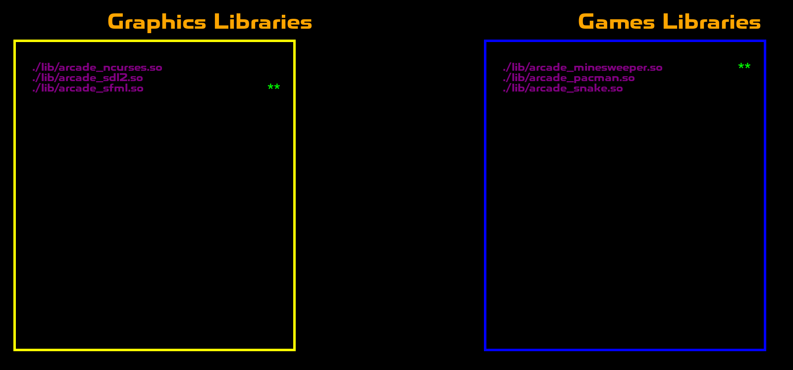
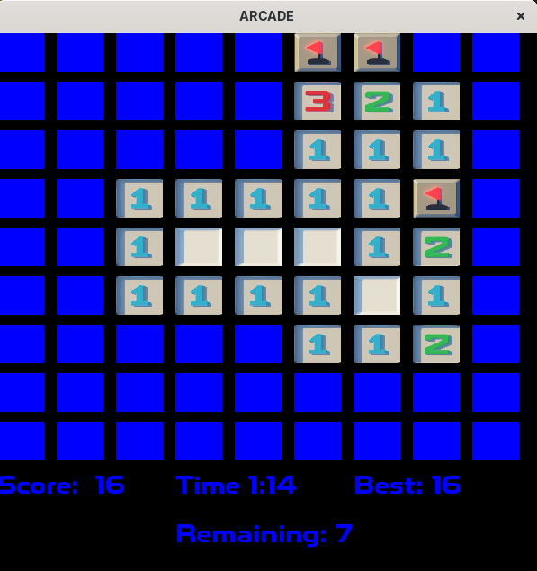
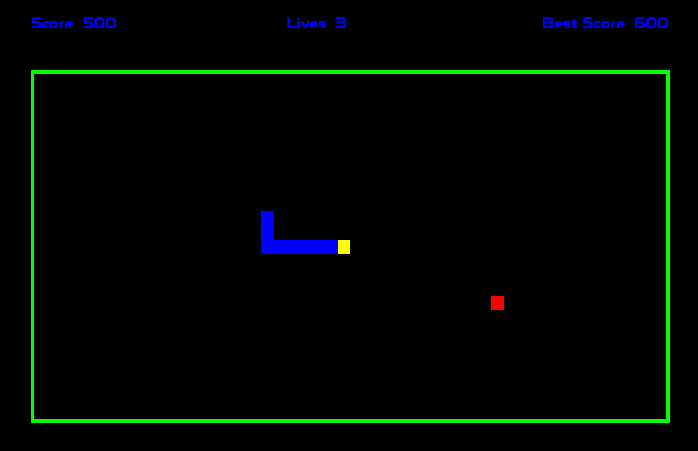

# Arcade - A RETRO PLATFORMER 🎮

# 📝 Description

Arcade is a retro gaming platform developed in C++. It allows users to select and play various games while keeping track of player scores.

The project architecture is based on dynamically loaded libraries, ensuring flexibility in adding new games and graphical interfaces.

# ✨ Key Features

Dynamic selection of graphical libraries and games.

Player score management to track progress.

Compatibility with multiple graphical libraries and game engines.

Extendability: Implement new games and graphical interfaces via dynamic libraries.

## 📚 Documentation

[Open the Documentation](doc/html/index.html)

## 🎮 Controls

Use the following keys to interact with the Arcade platform:

- `Enter` : Launch the selected game  
- `Escape` : Quit the current game  
- `Delete` : Switch to another game  
- `M` : Return to the main menu  
- `P` / `O` : Change the graphical library  

## 🖼️ Screenshots

A preview of the user interface:

  
*Game and graphical library selection menu*

<p align="center">
  
  <br>
  <em>MineSweeper</em>
</p>


*Snake*

*Example of a launched game using a selected graphic interface*

## 👥 Group

**Leader:**  
- guillaume1.blondel → guillaume1.blondel@epitech.eu  

**Members:**  
- aurelien.peres → aurelien.peres@epitech.eu  
- hugo.poggetti → hugo.poggetti@epitech.eu  

## 🛠️ Installation & Usage

# 📦 Compilation

```
mkdir -p ./build/ && cd ./build/
cmake .. -G "Unix Makefiles" -DCMAKE_BUILD_TYPE=Release 
cmake --build ./
```
or 
```
./build.sh
```

# 🧹 Clean 

```
./clean.sh
```
